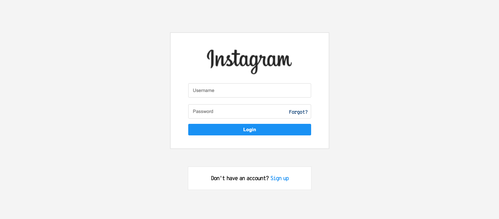
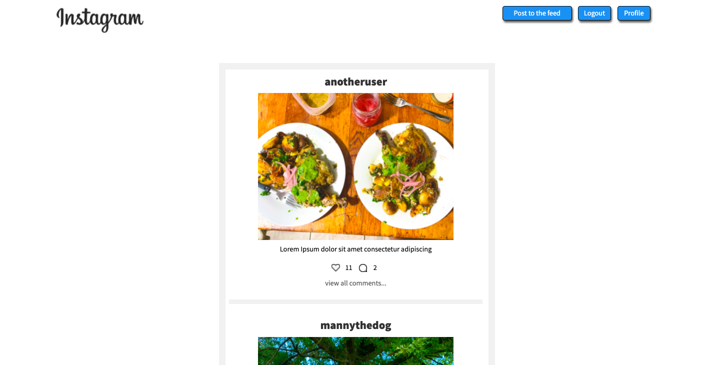
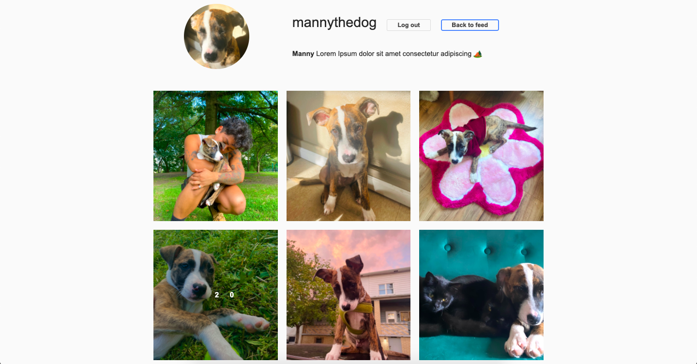

## Goal
Create a fullstack social media app with User Login where users can signup or login to their account, post and add to the "feed" of other uses posts, and like/comment on other people's posts.

## How it's made
Made using CSS, Javascript, API, Node.js, JSON, Express, EJS, MongoDB, Mongoose, Multer, and User Authentification using passport.

## Lessons learned
Learning is a constant! Had a real tight turnaround deadline for this project, but was able to meet all the requirements, and allow users to like the post if they double-tapped the image, similar to the real social media app. I also used multer so users can upload their images to the server. I feel pretty proud of the general outcome, but I do want to return to this to expand the functionality and allow users to delete their comments or posts. 
